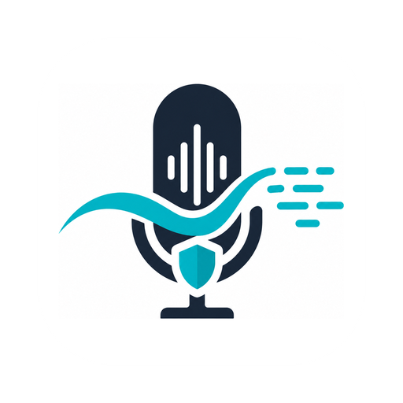

  

<h1 align="center">VoxFlow</h1>

<strong>Speak anywhere. VoxFlow writes it for you.</strong>

  Hold Option+Ctrl. Say the thing. Let go. 
  Clean text lands at your cursor, in whatever app you were already in.

  <a href="https://voxflow.cachevector.com">voxflow.cachevector.com</a>
  &nbsp;|&nbsp;
  <a href="https://voxflow.cachevector.com/docs">Docs</a>

VoxFlow is voice dictation for macOS that feels like part of the OS. Whisper transcribes on your machine. An AI pass turns the rambling into a sentence. The result is pasted where you were already typing.

No subscription. No account. You bring the key, or you bring nothing at all and stay fully local.

macOS 13 or later. Apple Silicon recommended. Linux is on the way.

## The workflow

Five stages between your voice and your cursor.

1. **Hold the keys.** Option+Ctrl, anywhere in macOS. A small pill fades in at the bottom of the screen. Nothing takes focus. Nothing covers what you were reading.
2. **Speak.** Audio is captured and gated by a voice activity detector, so the silence at either end never reaches the model.
3. **Whisper transcribes on device.** Your audio does not leave the machine.
4. **An AI pass cleans it up.** Fillers drop. Grammar lands. You get a sentence you would have typed. On by default, not a paid add-on. Turn it off if you want.
5. **It lands at your cursor.** Editor, terminal, browser, chat, mail. Every transcript is kept locally so you can recover one you lost.

Hold for short phrases. Toggle for long ones. The pill is up in 80 ms. A short phrase is text inside 1.5 seconds.

## Why people switch

**It stays out of the way.** One pill while you talk, and nothing else. No window. No stolen focus. No modal.

**It is fast enough to trust.** The hot path is Rust. The interface only draws what already happened.

**Your audio stays home.** Only the transcript text is sent to a rewrite provider, and only if you want a rewrite. Skip the cloud and VoxFlow makes no network calls.

**It works where you write.** The same hotkey works in Cursor, VS Code, Slack, Gmail, Notion, Obsidian, browsers, and terminals.

**Your keys stay in the Keychain.** Never in a plaintext settings file. History is a SQLite file you own.

**Costs stay visible.** Each dictation is tracked. The month is projected. You get a warning at the cap you set.

## Your voice. Your key. Your price.

Transcription is local. The rewrite pass talks to any OpenAI-compatible endpoint, or to nobody.

| How you run it | What you pay VoxFlow | What leaves the machine |
| --- | --- | --- |
| Fully local | Nothing | Nothing |
| Local Whisper + cloud rewrite | Nothing | A short piece of text |
| Your own server | Nothing | Whatever you pointed it at |

VoxFlow is free to build today, MIT licensed. There is no VoxFlow subscription for minutes of speech. You pay Groq, OpenAI, or your own hardware directly for exactly what you use.

Same idea as the paid dictation apps. Different economics, and a different privacy model.

## Get it on your Mac

macOS 13+, Apple Silicon.

1. Download [VoxFlow-macos-arm64.dmg](https://github.com/cachevector/voxflow/releases/latest/download/VoxFlow-macos-arm64.dmg).
2. Open the disk image and drag VoxFlow into Applications.
3. Launch it from Applications. It lives in the menu bar.
4. Grant Microphone and Accessibility when macOS asks.
5. Focus a text field. Hold **Option+Ctrl**. Talk.

A browser-downloaded DMG is quarantined until the release is notarized. On this Mac, `pnpm tauri build` still produces an app you can open directly.

Need Linux notes, provider setup, or a source build? Start at [the docs](https://voxflow.cachevector.com/docs) or [docs/macos-setup.md](docs/macos-setup.md).

## License

MIT. Read every line before you trust it with a microphone.
